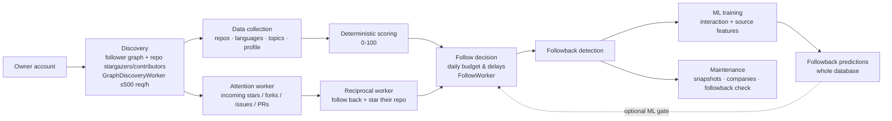

# GitHub Social Agent

**Turn your GitHub account into a growing professional network — automatically.**

[]()
[]()
[]()
[]()
[]()
[]()
[]()
[]()

---
## Disclaimer

This project uses the GitHub API and must be used according to
GitHub's Terms of Service and API usage policies.

Automated actions such as following, unfollowing, and starring
repositories should be configured responsibly.
---

## Be Found — and Followed Back

Every developer on GitHub is a potential professional connection: a future colleague, a recruiter, a client, or simply an interesting person who shares your stack. But finding "your people" among billions of accounts by hand is nearly impossible — and mass "blind" following burns through rate limits and reputation.

**GitHub Social Agent** takes care of it for you:

- **Finds developers genuinely close to your stack** — it analyzes each candidate's languages, topics, and repository freshness and compares them against your own profile.
- **Grows along two dimensions at once** — the follower graph (from your followers to their followers) *and* the content dimension (stargazers and contributors of your own repositories).
- **Predicts reciprocity with a neural network** — a built-in PyTorch model estimates the probability that a candidate will follow you back, based on your own followback history.
- **Answers attention with attention** — when someone stars, forks, or opens an issue/PR on your repos, the bot follows them back and stars their most relevant repository.
- **Works in a "silent mode"** — human-like pauses with jitter, respect for GitHub rate limits, and automatic recovery after hitting them. No bans, no "spam bot" flags.
- **Grows by itself** — it walks the network, collects data, retrains the model, and follows the best candidates within a daily limit. Launch it once — and it keeps working for weeks.
- **Gives you full control via a web dashboard** — growth analytics, candidate profiles, ML model health, worker management, and one-click job launching.

Simply "switch it on" once — and watch your GitHub network grow in a targeted, meaningful way instead of a chaotic one.

---

## Table of Contents

- [What It Is and What Problems It Solves](#what-it-is-and-what-problems-it-solves)
- [Key Features](#key-features)
- [How It Works](#how-it-works)
- [Web Dashboard: User Experience](#web-dashboard-user-experience)
- [Screenshots](#screenshots)
- [Technology Stack](#technology-stack)
- [Project Structure](#project-structure)
- [Quick Start](#quick-start)
- [CLI Commands](#cli-commands)
- [Configuration](#configuration)
- [Scoring Algorithm (0-100)](#scoring-algorithm-0-100)
- [ML Followback Prediction Pipeline](#ml-followback-prediction-pipeline)
- [Database](#database)
- [Logging and Graceful Shutdown](#logging-and-graceful-shutdown)
- [Troubleshooting (FAQ)](#troubleshooting-faq)

---

## What It Is and What Problems It Solves

**GitHub Social Agent** is an autonomous "smart networking" system for GitHub. It consists of two parts:

1. **Analysis bot** (Python) — collects and analyzes GitHub data and makes follow decisions.
2. **Web dashboard** (FastAPI + React) — visual analytics and system management.

### Problems the system solves

| Problem | How it is solved |
|---|---|
| **Finding relevant developers** | Walks the follower graph *and* mines the owner's own repos for stargazers/contributors — the network grows on its own |
| **Assessing "how interesting this person is to me"** | 0-100 scoring: base profile metrics + similarity of language/topics/activity to your stack |
| **Choosing "who to follow so they follow you back"** | A neural network predicts the followback probability as a second opinion — an optional gate (off by default) that can veto low-confidence candidates |
| **Automating follows** | Auto-follows candidates above the threshold within the daily limit |
| **Answering attention** | A reciprocal worker follows new interactors and stars their most relevant repo (paced like follows) |
| **Growing the network without manual work** | Silent mode runs continuously: collects, scores, follows, and waits for new data |
| **Tracking mutual follows** | Followback detector: you follow → they follow back → the status is recorded |
| **Mutual-follow hygiene** | A background worker checks who unfollowed after a mutual follow |
| **Inactive-follow cleanup** | An unfollow worker unfollows long-stale follows that never followed back nor interacted |
| **Control and analytics** | Dashboard: KPIs, growth charts, score distribution, action history, ML state, worker control |
| **Protection against rate limits and bans** | Respects `Retry-After`, exponential backoff, cooldown, ETag requests (304 = free) |

---

## Key Features

- **A single working mode `--silent`** — a self-sustaining daemon: waits for the first followers, syncs the owner's profile, collects data, scores (follows are handled by the dedicated FollowWorker), retrains the model, and grows on its own. It does not stop after the first batch.
- **First-run gates** — on a brand-new account it does not silently finish with "0 users" but patiently waits for the first followers and the owner's data.
- **Parallel processing** — up to `SILENT_WORKERS` threads (2 by default) split the user queue, speeding up processing several times while keeping pauses between actions.
- **Dedicated follow worker** — the system's *only* follower: a separate daemon thread (`workers/follow_worker.py`) subscribes to candidates by score (highest first, ≥ threshold) with a random 20–30 min pause between subscriptions, within the daily limit. The queue is re-read fresh before every follow and deleted users are skipped; when no qualifying candidates exist the worker simply waits for new scored users.
- **Shared daily action budget** — follows *and* unfollows draw from **one combined pool** (50 actions/day, e.g. 40 follows + 10 unfollows). Both workers count against the same meter shown on the dashboard.
- **Unfollow worker** — a dedicated daemon thread (`workers/unfollow_worker.py`) unfollows users who were followed 7+ days ago, never followed back, and never interacted with your profile or repos (checked live via the public events timeline). Same 20–30 min pacing, same budget as follows.
- **Attention worker** — polls the owner's received-events timeline hourly, persists every interaction (star / fork / issue / PR / comment / follow) into the `interactions` table, and adds new actors to the pipeline (source `repo_interaction`). Persisted interactions also protect already-followed users from the unfollow worker.
- **Reciprocal worker** — answers attention with attention: follows new interactors and stars their most relevant repository (highest stars / matching topics), paced like follows within the shared budget. Every reciprocal action is recorded (`we_followed_back` / `we_starred`) so ML features can separate correlation from causation.
- **Calm graph-growth worker** — a separate background thread walks the follower graph with a fixed budget of ≤ 500 requests/hour without disturbing the main processing.
- **Repo-content discovery** — the same calm worker mines the owner's own repositories for **stargazers and contributors** (rotation tracked in `discovery_sources`): people who already publicly declared interest in exactly the kind of content you produce — 1 request ≈ up to 100 candidates.
- **0-100 scoring by similarity to your stack** — languages (histogram intersection), topics (Jaccard index), repository freshness.
- **ML follow-back prediction (shadow mode)** — an experimental PyTorch model that learns from historical follow-back data. **Interaction and source features** (what the user did before following, and where they were discovered) improve the model's signal. It currently operates in shadow mode by default and does not influence follow decisions.
- **ML follow gate (optional second opinion)** — a runtime "strictness" dial: when enabled, a candidate whose stored followback prediction is below the threshold is skipped, so the daily budget goes to users the model believes will reciprocate. Off by default — flip it in the Management tab (no restart needed).
- **Stealth mode** — human-like delays with jitter; `/languages` is skipped for forks and heavyweight repositories (protection against secondary rate limits).
- **GitHub rate-limit resilience** — retries driven by server hints (`Retry-After` / `X-RateLimit-Reset`), cooldown, and an immediate stop on an invalid token.
- **API request economy** — ETag conditional requests (304 = free), data freshness TTLs (repos, scores, follower scans, languages).
- **Followback detector + mutual-follow check worker** — users who unfollow after a mutual follow are tracked automatically.
- **Daily snapshots** — at midnight in the user's timezone, followers / following / public repos are recorded for growth charts.
- **Company enrichment** — `@org` mentions from the `company` field become organization profiles.
- **Web dashboard** — 4 pages: analytics, candidates, ML, management.
- **Worker control from the dashboard** — every background worker (9 in total) can be paused/resumed with a switch; per-worker lifecycle (started, stopped, last action, last error) is shown live.
- **Automatic database migrations** — applied on startup by both the bot and the dashboard (lock-serialized, so simultaneous container boot is safe); a manual `--migrate` is never required.
- **Docker deployment** — bot + dashboard in `docker-compose`; data, logs, and models survive rebuilds.

---

## How It Works



### Stages

1. **Discovery.** The network grows along two dimensions. The follower graph is traversed from your account outward (your followers, then theirs, and so on). In parallel, the owner's own repositories are mined for stargazers and contributors (seed rotation tracked in `discovery_sources`) — people who already like your content. One bounded pass per hour keeps the traffic calm.

2. **Data collection.** For every discovered user, the bot collects profile information, repositories, language statistics, and repository topics. GitHub ETag conditional requests are used whenever possible: unchanged resources return `304 Not Modified` and do not consume the rate limit.

3. **Deterministic scoring.** Every candidate receives a transparent 0–100 score based on profile quality and similarity to the owner's technology stack. This score is currently the production decision engine used for automatic following.

4. **Following.** The dedicated `FollowWorker` thread is the only follower in the system. It subscribes to candidates by score — highest first, never below the threshold — with a random 20–30 minute pause between subscriptions, within the shared daily budget (follows + unfollows combined). The queue is re-read fresh before every follow, deleted users are skipped, and when no qualifying candidates exist it simply waits for new scored users. The **unfollow worker** mirrors this rhythm for stale follows.

5. **Attention & reciprocity.** The attention worker polls your received-events timeline hourly and records who starred, forked, or opened issues/PRs on your repositories. The reciprocal worker then follows those interactors and stars their most relevant repository — a human, non-spammy way of returning the gesture. Every reciprocal action is persisted for ML hygiene.

6. **ML training and evaluation.** Independently from the production pipeline, the system continuously learns from historical followback outcomes — now enriched with **interaction features** (what the user did on your repos *before* following, strictly time-ordered to avoid label leakage) and **source features** (stargazers vs contributors vs graph discovery vs repo interaction). The PyTorch model is retrained on startup and every 24 hours, after which followback probabilities are recomputed for every candidate and stored for analysis.

7. **Maintenance.** Background workers monitor mutual follows, detect users who unfollow, clean up stale follows, create daily growth snapshots, enrich organization information, and keep the database up to date.

> **Current status**
>
> The deterministic scoring algorithm is responsible for follow decisions.
> ML predictions are generated, evaluated, and continuously improved in
> parallel — and an optional ML follow gate (off by default) can make the
> model a hard second opinion on every follow.
> Once sufficient real-world validation has been collected, the model will
> become an additional ranking signal for candidate selection.

---

## Web Dashboard: User Experience

The dashboard is the system's "command center," styled after GitHub: a dark header, a light canvas, cards, and tidy badges. All pages auto-refresh at the selected cadence (from 3 seconds to 30 minutes — adjustable with the slider in Management and remembered by the browser).

### Overview

- **7 KPI cards**: users discovered, follows/unfollows (combined daily budget), following now, followbacks (with conversion %), scored, ML followback candidates, GitHub API usage (requests per hour and the share of the 5000/h limit).
- **Followers growth** — a chart of your followers and followings over 30 days (based on daily snapshots).
- **Pipeline status** — how many users entered each status (NEW → FOLLOWED → FOLLOWBACK / UNFOLLOWED / DELETED).
- **Score distribution** — distribution of candidate scores.
- **Recent activity** — a feed of the latest events: follows, followbacks, unfollows, deleted accounts.
- **Interactions** — a live feed of people who starred / forked / opened issues or PRs on your repositories (from the attention worker).
- Data interval toggle: today / 3 days / 7 days / 15 days / month.

### Users

- A table of all discovered developers: avatar, username, bio, **score** (ring + color), followers, repositories, languages (colored dots), status.
- **Search** by name and bio (debounced), **filters** by status, language, and ML prediction, **sorting** by score/followers/repositories/dates, pagination.
- Clicking a row opens the **profile in a drawer**: languages with weights, topics, companies, top repositories, ML prediction, dates, GitHub link.

### ML

- **KPIs**: predictions computed, predicted followback / no followback, training sample (positives/negatives).
- **Trend verdict** — a green/yellow/red badge answering "is it time to invest in the model again?" based on the last N retrains (CV AUC, sample size, precision), not just the latest noisy run.
- **Current model** — metadata of the deployed model: version, sample size, number of features (interaction + source included), CV AUC, hold-out metrics, early stopping, label scheme.
- **CV AUC chart across retrains** — the honest quality estimate (5-fold CV; the dashed line is the random baseline of 0.5).
- **Training-run history** — a table of all retrains with metrics and recompute results.

### Management

- **Workers** — switches for all **nine** background daemon threads: follow, unfollow, graph discovery, ML trainer, companies, followback check, attention, reciprocal, snapshots. All are **active by default**; toggling one off pauses it and back on resumes it — no restart needed, the change applies on the worker's next cycle.
- **Worker activity** — per-worker lifecycle from the `worker_status` table: when the worker started, stopped, last completed an action, and last hit an error (with the error message).
- **ML follow gate** — the strictness dial (enabled switch + threshold), with a background recompute of all predictions when it changes.
- **Bot configuration** — current settings: follow limit, score threshold, freshness TTLs, ML retrain interval, etc.
- **Timezone** — auto-detected from the browser; day boundaries depend on it (daily limit reset, midnight snapshots).
- **Refresh interval** — a slider for the auto-refresh cadence of all pages.
- **Graph-growth worker** — how many users were walked, new users found, hourly request budget used.

---

## Screenshots

| Overview — network growth analytics | Users — candidates, scoring, and ML prediction |
|---|---|
|  |  |

| ML — followback prediction model | Management — job launching and settings |
|---|---|
|  |  |

---

## Technology Stack

| Layer | Technologies |
|---|---|
| **Bot (backend)** | Python 3.12, `requests`, `python-dotenv` |
| **Machine learning** | PyTorch 2.x, NumPy |
| **Dashboard API** | FastAPI, Uvicorn, Pydantic |
| **Frontend** | React 18, TypeScript 5.6, Vite 5, Tailwind CSS 3.4, Recharts, lucide-react, React Router 6 |
| **Database** | SQLite (WAL mode, `busy_timeout`), versioned migrations (auto-applied on startup) |
| **Infrastructure** | Docker, Docker Compose (two containers: bot + dashboard, host network) |
| **External API** | GitHub REST API (users, repositories, languages, topics, follows, stars, events) |

---

## Project Structure

```
.
├── main.py                 # CLI entry point: all bot modes (--silent, --score, ...)
├── core/                   # Infrastructure: config, logger, database (SQLite), github_client, tz
├── services/               # Bot logic: collector, scorer, silent
├── workers/                # Background threads: follow, unfollow, graph discovery, attention,
│                           #   reciprocal, ML trainer, followback check, companies, snapshots
├── ml_service/             # ML: features (incl. interaction/source), model (PyTorch), trainer,
│                           #   inference, evaluate, recompute
├── api/                    # FastAPI dashboard: /api/*, job launching, serving the built frontend
├── frontend/               # React SPA: Overview / Users / ML / Management pages
├── migrations/             # Versioned SQLite migrations + runner (auto-applied at startup)
├── data/                   # SQLite database (gitignored)
├── logs/                   # Bot and job logs (gitignored)
├── models/                 # Trained ML models (gitignored)
├── Dockerfile
└── docker-compose.yml
```

---

## Quick Start

### Prerequisites

- **Python 3.10+** (3.12 recommended)
- **Node.js 18+** and npm (only for frontend development)
- **Docker + Docker Compose** (for containerized deployment)
- **GitHub Personal Access Token** — a classic token with permission to read public data, follow (scope `user`, includes `user:follow`), and star repositories

### Step 1. Clone and install

```bash
git clone https://github.com/Lewickiy/github-social-agent.git
cd github-social-agent

python -m venv .venv
source .venv/bin/activate        # Windows: .venv\Scripts\activate

pip install -r requirements.txt
```

### Step 2. Configuration

Create a `.env` file in the project root (the system reads it automatically):

```bash
# Required: your GitHub token
GITHUB_TOKEN=ghp_your_token_here

# Optional: override paths
# DATABASE=data/github_social.db
# LOG_FILE=logs/github_social.log
```

Set your account in `core/config.py`: change `MY_USERNAME = "Lewickiy"` to your login.

### Step 3. Run the bot (main mode)

```bash
python main.py --silent
```

This is the only working mode "out of the box": the system waits for the first followers, syncs your profile, collects and scores candidates, starts following the best ones, and runs continuously. **Database migrations are applied automatically on startup** — no manual `--migrate` step is needed.

### Step 4. Run the web dashboard

**Option A — dev mode (API + frontend separately):**

```bash
# Terminal 1 — API on :8000
uvicorn api.app:app --host 127.0.0.1 --port 8000

# Terminal 2 — Vite dev server on :5173 (proxies /api to :8000)
cd frontend
npm install
npm run dev
```

Open **http://localhost:5173**.

**Option B — production build (FastAPI serves the frontend):**

```bash
cd frontend
npm install
npm run build
cd ..

uvicorn api.app:app --host 127.0.0.1 --port 8000
```

Open **http://localhost:8000** — the API and the built SPA are available at a single address.

### Running with Docker

```bash
# Directories for data, logs, and models (important: otherwise Docker creates them as root)
mkdir -p data logs models

# .env is required — it holds GITHUB_TOKEN (and optionally UID/GID)
echo "GITHUB_TOKEN=ghp_your_token_here" > .env

docker compose up --build
```

Both services start (containers run on the **host network**, so traffic follows the host's routing — e.g. works through a VPN):

| Service | What it does | Address |
|---|---|---|
| `github-bot` | the bot in `--silent` mode (auto-migrates on boot) | — |
| `github-dashboard` | the web dashboard (auto-migrates on boot) | http://localhost:8087 |

One-off modes inside the container:

```bash
docker compose run --rm github-bot --score
docker compose run --rm github-bot --migrate-status
```

> **Note.** Inside the containers the paths are `/app/data`, `/app/logs`, `/app/models` — the directories are mounted from the host, so the database, logs, and ML models survive container rebuilds. Migrations are applied automatically by both containers at startup (serialized by a lock file, so simultaneous boot is safe).

---

## CLI Commands

### Main mode

| Command | Description |
|---|---|
| `--silent` | **The only working mode.** Collection + scoring + follows with human-like pauses. Waits for the first followers / owner data, grows on its own, and runs continuously. |

### Force modes (usually not needed — `--silent` covers everything)

| Command | Description |
|---|---|
| `--collect-users` | Phase 1: walk the follower graph, discover new users |
| `--collect-users-rep` | Phase 2: fetch repositories, languages, and topics for every known user |
| `--collect` | Both phases: discovery + repository collection |
| `--collect-self` | Force-refresh your own (owner) profile — the scoring baseline |
| `--score` | Score / re-score all users |

### Utilities

| Command | Description |
|---|---|
| `--migrate` | Apply pending database migrations (usually not needed — auto-applied on startup) |
| `--migrate-status` | Show migration status |
| `--top` | Top 50 unscored users |
| `--profile USER` | Show a detailed developer profile |
| `--snapshot` | Record today's profile snapshot manually |

### Additional utilities

```bash
python -m migrations.runner --status       # migration status
python -m migrations.runner --rollback     # roll back the last migration
python -m ml_service.recompute_predictions  # recompute ML predictions for the whole database
python -m ml_service.evaluate --new-sample 300  # model quality diagnostics
```

---

## Configuration

### Environment variables (`.env`)

| Variable | Description | Default |
|---|---|---|
| `GITHUB_TOKEN` | **Required.** GitHub token (classic, scope `user`, includes `user:follow`) | — |
| `DATABASE` | Path to the SQLite database | `data/github_social.db` |
| `LOG_FILE` | Path to the log file | `logs/github_social.log` |
| `UID` / `GID` | Container user (docker-compose) | `1000` / `1000` |

### Key settings (`core/config.py`)

| Setting | Value | Description |
|---|---|---|
| `MY_USERNAME` | `Lewickiy` | Your GitHub login (the owner — the scoring baseline) |
| `DAILY_FOLLOW_LIMIT` | `50` | **Combined** daily budget: follows + unfollows together |
| `FOLLOW_INTERVAL_MIN_SECONDS` | `1200` | Minimum random pause between follows (20 min) |
| `FOLLOW_INTERVAL_MAX_SECONDS` | `1800` | Maximum random pause between follows (30 min) |
| `SILENT_FOLLOW_SCORE_THRESHOLD` | `35` | Minimum score for auto-following |
| `SILENT_WORKERS` | `2` | Parallel silent-mode threads |
| `FOLLOW_WORKER_ENABLED` | `True` | Fresh-install default of the Follow worker toggle (runtime control: Management → Workers) |
| `FOLLOW_WORKER_POLL_INTERVAL_SECONDS` | `60` | How often the follow worker re-checks the queue when idle |
| `UNFOLLOW_WORKER_ENABLED` | `True` | Fresh-install default of the Unfollow worker toggle |
| `UNFOLLOW_AFTER_DAYS` | `7` | Unfollow candidates followed this long who never responded/interacted |
| `ATTENTION_WORKER_ENABLED` | `True` | Fresh-install default of the Attention worker toggle |
| `ATTENTION_POLL_INTERVAL_HOURS` | `1` | How often the attention worker polls the owner's event timeline |
| `RECIPROCAL_WORKER_ENABLED` | `True` | Fresh-install default of the Reciprocal worker toggle |
| `RECIPROCAL_POLL_INTERVAL_SECONDS` | `300` | How often the reciprocal worker re-polls an empty queue |
| `SILENT_CONTINUOUS` | `True` | Continuous mode (don't exit after the queue) |
| `DISCOVERY_WORKER_ENABLED` | `True` | Fresh-install default of the Graph-discovery worker toggle |
| `DISCOVERY_RATE_LIMIT_PER_HOUR` | `500` | Hourly request budget of the graph-growth worker |
| `DISCOVERY_PASS_MAX_USERS` | `500` | Users per graph-growth pass |
| `DISCOVERY_REPO_FANS_ENABLED` | `True` | Mine owner repos for stargazers/contributors each pass |
| `DISCOVERY_REPO_FANS_INCLUDE_CONTRIBUTORS` | `True` | Also fetch contributors of each seed (stargazers always) |
| `DISCOVERY_REPO_FANS_MAX_SEEDS` | `5` | Seeds (owner repos) mined per discovery pass |
| `ML_ENABLED` | `True` | Enable ML predictions |
| `ML_TRAIN_INTERVAL_HOURS` | `24` | Retrain the model every N hours |
| `ML_FOLLOW_GATE_ENABLED` | `False` | ML follow gate master switch (runtime-tunable in Management) |
| `ML_FOLLOW_THRESHOLD` | `0.5` | Minimum followback probability the gate requires |
| `REPO_FRESHNESS_DAYS` | `7` | User repository TTL |
| `OWNER_SYNC_DAYS` | `14` | How often the owner's profile is synced |
| `SCORE_FRESHNESS_DAYS` | `20` | Score TTL |
| `SNAPSHOT_HOUR` | `0` | Hour of the daily snapshot (local time) |
| `SKIP_FORK_LANGUAGES` | `True` | Skip `/languages` for forks (API economy) |

---

## Scoring Algorithm (0-100)

The score consists of two parts — the base part and the similarity to the owner's profile.

### Base part (0-35)

| Criterion | Points |
|---|---|
| Repositories > 5 | +5 |
| Repositories > 20 | +10 (15 total) |
| Followers > 20 | +5 |
| Followers > 100 | +10 (15 total) |
| Has a bio | +5 |

### Similarity to your stack (0-65)

| Criterion | Max points | Method |
|---|---|---|
| **Language similarity** | 30 | Histogram intersection of language distributions |
| **Topic similarity** | 20 | Jaccard index of topic sets |
| **Repository freshness** | 15 | Days since the most recent repository update |

**Languages (histogram intersection):** you and the candidate both have a language distribution (in %, summing to 100). The overlap is the sum of per-language minimums:

```
overlap = Σ min(your_%, their_%)
language_score = int((overlap / 100) * 30)
```

**Topics (Jaccard index):**

```
jaccard = |your_topics ∩ their_topics| / |your_topics ∪ their_topics|
topic_score = int(jaccard * 20)
```

**Repository freshness:**

| Days since last update | Points |
|---|---|
| ≤ 7 | 15 |
| ≤ 30 | 10 |
| ≤ 90 | 5 |
| > 90 | 0 |

---

## ML Followback Prediction Pipeline

- **Task:** binary classification — will the candidate follow back (label: followback within 7+ days).
- **Model:** a fully connected neural network (PyTorch): 2 hidden layers, dropout, sigmoid output. ~66 features: normalized profile (account age, presence of bio/company/blog, followers, etc.), repository aggregates (stars, forks, archived ratio, freshness), multi-hot over the top-10 languages and top-15 topics, **interaction features** (stars / forks / issues / PRs / comments the candidate made on the owner's repos — strictly *before* the follow, for temporal hygiene), and **source features** (one-hot: stargazers, contributors, graph discovery, repo interaction, owner followers, self).
- **Training:** class-balanced loss (1:1 weights instead of "predict everyone"), stratified split, early stopping, **stratified 5-fold cross-validation** as the honest quality estimate, fixed seed (42) — reproducible results.
- **Data gate:** training starts only when enough examples of both classes have accumulated (≥ 100 positives, ≥ 100 negatives, ≥ 250 total) — on a smaller sample the model cannot learn.
- **Cycle:** retraining on startup and every 24 hours → after each training the predictions are recomputed for the whole database in a background thread → metrics and distribution are saved into the `ml_training_runs` history.
- **ML follow gate:** off by default; when enabled from the Management tab, candidates whose stored prediction is below the threshold are not followed (prediction recompute runs in the background on threshold change).
- **Model versions:** the last 2 versions are kept on disk (`models/`); the rest are pruned.

---

## Database

SQLite database (`data/github_social.db`, WAL mode). In Docker the whole `./data` directory is mounted as `/app/data`, so WAL/SHM files always live next to the database on the host — the container, host scripts, and IDEs (PyCharm, DBeaver) all see the same files.

| Table | Description |
|---|---|
| `users` | Discovered users, score, ML prediction, status, owner flag |
| `actions` | Follow / unfollow log |
| `repositories` | User repositories |
| `languages` / `repository_languages` | Languages and their weights per repository |
| `topics` / `repository_topics` | Repository topics |
| `companies` / `user_companies` | Organizations from the company field + enriched data |
| `job_runs` | Dashboard job runs (statuses, PIDs, logs) |
| `user_snapshots` | Daily followers/following/repos snapshots |
| `user_status_history` / `user_current_status` | User status lifecycle |
| `github_api_requests` | GitHub API request metrics (for the dashboard KPIs) |
| `ml_training_runs` | ML model retrain history |
| `discovery_runs` | Graph-growth worker pass history |
| `discovery_sources` | Seed rotation for repo-content discovery (stargazers/contributors mining) |
| `interactions` | Persisted interactions with the owner's repos (actor, event type, repo, dedup key, real event timestamp, `we_starred` / `we_followed_back`) |
| `settings` | User settings (e.g., timezone, ML follow gate) |
| `worker_status` | Per-worker toggle + lifecycle (started/stopped/action/error/heartbeat) |
| `migrations` | Applied-migration tracking |

**Migrations** are applied **automatically** by the bot and the dashboard on startup (serialized by a lock file — safe when both containers boot together). Manual control is still available:

```bash
python main.py --migrate            # apply pending (usually not needed)
python main.py --migrate-status     # show status
python -m migrations.runner --rollback  # roll back the last one
```

---

## Logging and Graceful Shutdown

- All events (rate limits, retries, scoring, follows, shutdown) are written to `logs/github_social.log` (in Docker — `/app/logs/github_social.log`). The console shows only WARNING and above.
- Dashboard job logs — `logs/jobs/job_<id>.log`, accessible from the UI.
- **Ctrl+C once** → graceful shutdown: the bot finishes the current user, commits data, and exits. **Ctrl+C twice** → force exit. `SIGTERM` is handled the same way as the first Ctrl+C.

---

## Troubleshooting (FAQ)

| Problem | Solution |
|---|---|
| `Environment variable GITHUB_TOKEN is not set` | Create a `.env` with `GITHUB_TOKEN=...` or export the variable |
| `AUTH FAILURE — GitHub rejected the token` | The token is revoked/expired — generate a new one in GitHub settings |
| The bot went into cooldown for 1-2 hours | This is normal behavior when the limit is exhausted: exponential retries + cooldown, then automatic recovery |
| Dashboard: `Frontend not built` | `cd frontend && npm install && npm run build` |
| Docker: the container cannot write to `data/` / `logs/` | Delete the root-created directories and run `mkdir -p data logs models` before `docker compose up` |
| Empty account: "Waiting for work" in the console instead of work | This is normal: with gates enabled (`SILENT_GATES_ENABLED`), `--silent` does not finish with "0 users" but waits for the first followers / owner data and resumes on its own |
| ML page: "No model trained yet" | The model is trained only after ≥ 250 labeled examples (positives + negatives) have accumulated |
| New code deployed but tables look stale | Migrations are applied automatically on container startup; `docker compose restart` if the containers were already running during the deploy |

---

## License

This project is licensed under the Apache License 2.0.

See the [LICENSE](/LICENSE.md) file for details.
