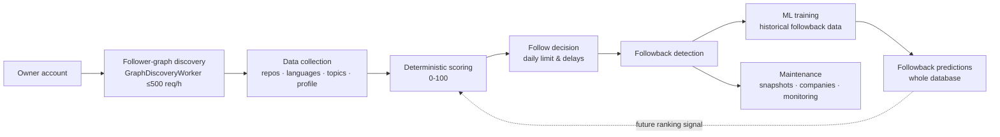
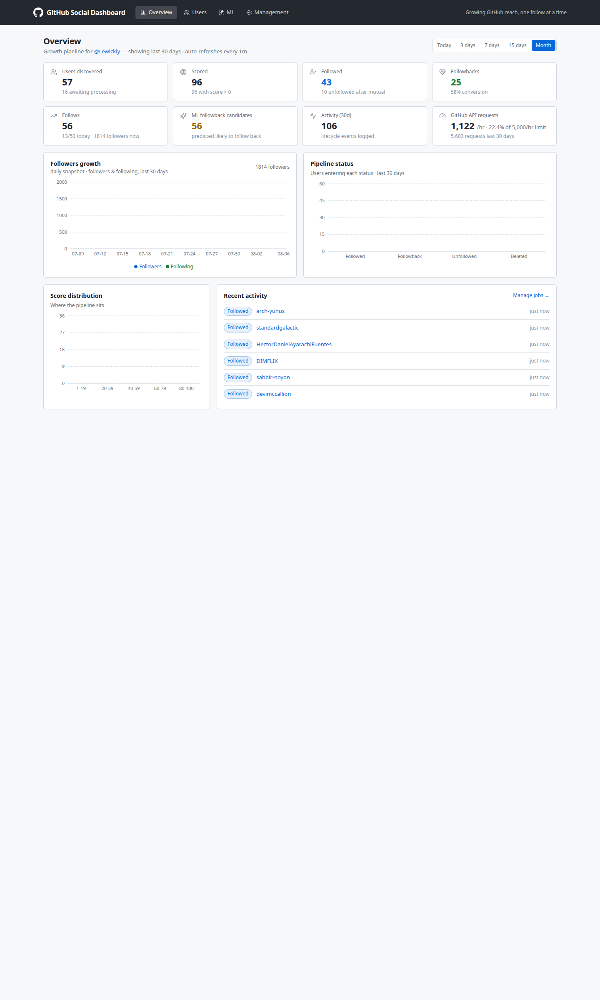
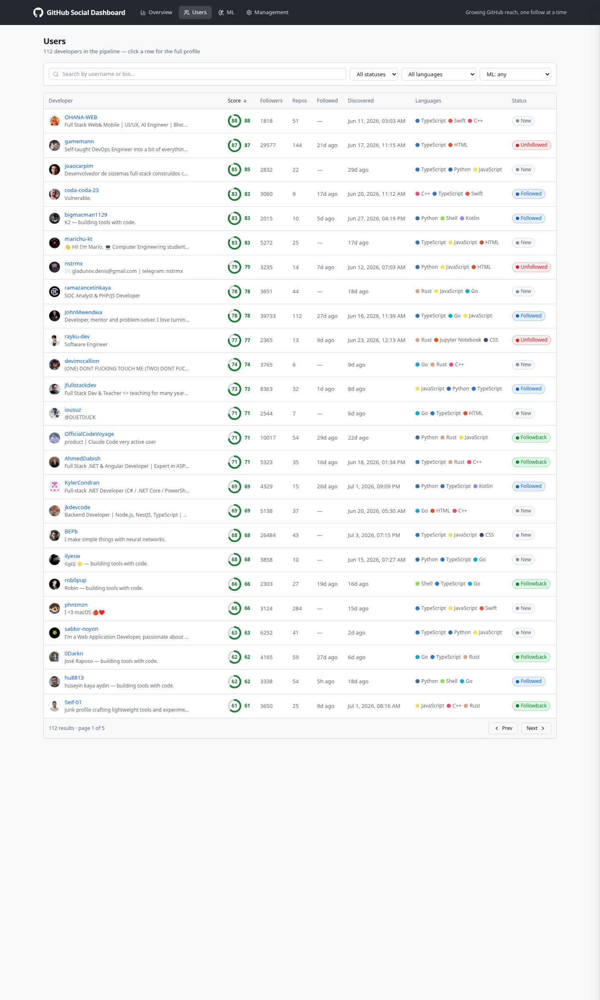
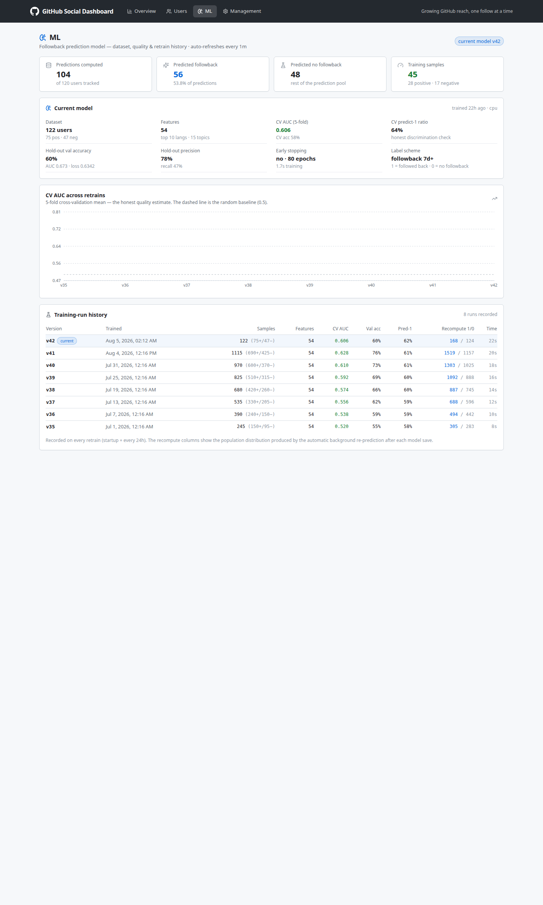
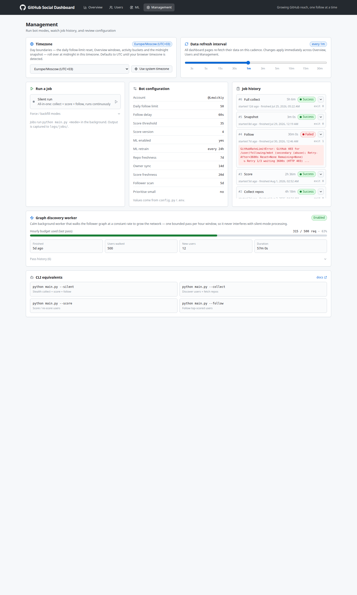

# GitHub Social Agent

**Turn your GitHub account into a growing professional network — automatically.**

[]()
[]()
[]()
[]()
[]()
[]()
[]()
[]()

---

## Be Found — and Followed Back

Every developer on GitHub is a potential professional connection: a future colleague, a recruiter, a client, or simply an interesting person who shares your stack. But finding "your people" among billions of accounts by hand is nearly impossible — and mass "blind" following burns through rate limits and reputation.

**GitHub Social Agent** takes care of it for you:

- **Finds developers genuinely close to your stack** — it analyzes each candidate's languages, topics, and repository freshness and compares them against your own profile.
- **Predicts reciprocity with a neural network** — a built-in PyTorch model estimates the probability that a candidate will follow you back, based on your own followback history.
- **Works in a "silent mode"** — human-like pauses with jitter, respect for GitHub rate limits, and automatic recovery after hitting them. No bans, no "spam bot" flags.
- **Grows by itself** — it walks the follower graph, collects data, retrains the model, and follows the best candidates within a daily limit. Launch it once — and it keeps working for weeks.
- **Gives you full control via a web dashboard** — growth analytics, candidate profiles, ML model health, and one-click job launching.

Simply "switch it on" once — and watch your GitHub network grow in a targeted, meaningful way instead of a chaotic one.

---

## Table of Contents

- [What It Is and What Problems It Solves](#what-it-is-and-what-problems-it-solves)
- [Key Features](#key-features)
- [How It Works](#how-it-works)
- [Web Dashboard: User Experience](#web-dashboard-user-experience)
- [Screenshots](#screenshots)
- [Technology Stack](#technology-stack)
- [Project Structure](#project-structure)
- [Quick Start](#quick-start)
- [CLI Commands](#cli-commands)
- [Configuration](#configuration)
- [Scoring Algorithm (0-100)](#scoring-algorithm-0-100)
- [ML Followback Prediction Pipeline](#ml-followback-prediction-pipeline)
- [Database](#database)
- [Logging and Graceful Shutdown](#logging-and-graceful-shutdown)
- [Troubleshooting (FAQ)](#troubleshooting-faq)
- [Documentation](#documentation)

---

## What It Is and What Problems It Solves

**GitHub Social Agent** is an autonomous "smart networking" system for GitHub. It consists of two parts:

1. **Analysis bot** (Python) — collects and analyzes GitHub data and makes follow decisions.
2. **Web dashboard** (FastAPI + React) — visual analytics and system management.

### Problems the system solves

| Problem | How it is solved |
|---|---|
| **Finding relevant developers** | Walks the follower graph: from your followers to their followers and deeper — the network grows on its own |
| **Assessing "how interesting this person is to me"** | 0-100 scoring: base profile metrics + similarity of language/topics/activity to your stack |
| **Choosing "who to follow so they follow you back"** | A neural network predicts the followback probability and augments the candidate's score |
| **Automating follows** | Auto-follows candidates above the threshold within the daily limit |
| **Growing the network without manual work** | Silent mode runs continuously: collects, scores, follows, and waits for new data |
| **Tracking mutual follows** | Followback detector: you follow → they follow back → the status is recorded |
| **Mutual-follow hygiene** | A background worker checks who unfollowed after a mutual follow |
| **Control and analytics** | Dashboard: KPIs, growth charts, score distribution, action history, ML state |
| **Protection against rate limits and bans** | Respects `Retry-After`, exponential backoff, cooldown, ETag requests (304 = free) |

---

## Key Features

- **A single working mode `--silent`** — a self-sustaining daemon: waits for the first followers, syncs the owner's profile, collects data, scores, follows, retrains the model, and grows on its own. It does not stop after the first batch.
- **First-run gates** — on a brand-new account it does not silently finish with "0 users" but patiently waits for the first followers and the owner's data.
- **Parallel processing** — up to `SILENT_WORKERS` threads (2 by default) split the user queue, speeding up processing several times while keeping pauses between actions.
- **Calm graph-growth worker** — a separate background thread walks the follower graph with a fixed budget of ≤ 500 requests/hour without disturbing the main processing.
- **0-100 scoring by similarity to your stack** — languages (histogram intersection), topics (Jaccard index), repository freshness.
- **ML follow-back prediction (shadow mode)** — an experimental PyTorch model that learns from historical follow-back data and evaluates its predictions on live data. The model currently operates in shadow mode: it does not influence production decisions, which are still fully controlled by the deterministic scoring algorithm.
- **Stealth mode** — human-like delays with jitter; `/languages` is skipped for forks and heavyweight repositories (protection against secondary rate limits).
- **GitHub rate-limit resilience** — retries driven by server hints (`Retry-After` / `X-RateLimit-Reset`), cooldown, and an immediate stop on an invalid token.
- **API request economy** — ETag conditional requests (304 = free), data freshness TTLs (repos, scores, follower scans, languages).
- **Followback detector + mutual-follow check worker** — users who unfollow after a mutual follow are tracked automatically.
- **Daily snapshots** — at midnight in the user's timezone, followers / following / public repos are recorded for growth charts.
- **Company enrichment** — `@org` mentions from the `company` field become organization profiles.
- **Web dashboard** — 4 pages: analytics, candidates, ML, management.
- **Job launching from the dashboard** — any bot mode starts with one click, with history, logs, and statuses.
- **Docker deployment** — bot + dashboard in `docker-compose`; data and models survive rebuilds.

---

## How It Works



### Stages

1. **Discovery.** Starting from your account, the system gradually traverses the follower graph: first your followers, then their followers, and so on. A dedicated graph-growth worker performs one bounded pass per hour, ensuring steady discovery without generating bursts of API traffic.

2. **Data collection.** For every discovered user, the bot collects profile information, repositories, language statistics, and repository topics. GitHub ETag conditional requests are used whenever possible: unchanged resources return `304 Not Modified` and do not consume the rate limit.

3. **Deterministic scoring.** Every candidate receives a transparent 0–100 score based on profile quality and similarity to the owner's technology stack. This score is currently the production decision engine used for automatic following.

4. **Following.** Candidates whose score exceeds the configured threshold are followed automatically. Human-like delays, daily limits, cooldowns, and GitHub rate-limit handling ensure safe long-running operation.

5. **ML training and evaluation.** Independently from the production pipeline, the system continuously learns from historical followback outcomes. The PyTorch model is retrained on startup and every 24 hours, after which followback probabilities are recomputed for every candidate and stored for analysis.

6. **Maintenance.** Background workers monitor mutual follows, detect users who unfollow, create daily growth snapshots, enrich organization information, and keep the database up to date.

> **Current status**
>
> The deterministic scoring algorithm is currently responsible for follow decisions.
> ML predictions are generated, evaluated, and continuously improved in parallel.
> Once sufficient real-world validation has been collected, the model will become an additional ranking signal for candidate selection.
---

## Web Dashboard: User Experience

The dashboard is the system's "command center," styled after GitHub: a dark header, a light canvas, cards, and tidy badges. All pages auto-refresh at the selected cadence (from 3 seconds to 30 minutes — adjustable with the slider in Management and remembered by the browser).

### Overview

- **8 KPI cards**: users discovered, scored, followed, followbacks (with conversion %), follows today / limit, ML candidates, activity, GitHub API usage (requests per hour and the share of the 5000/h limit).
- **Followers growth** — a chart of your followers and followings over 30 days (based on daily snapshots).
- **Pipeline status** — how many users entered each status (NEW → FOLLOWED → FOLLOWBACK / UNFOLLOWED / DELETED).
- **Score distribution** — distribution of candidate scores.
- **Recent activity** — a feed of the latest events: follows, followbacks, unfollows, deleted accounts.
- Data interval toggle: today / 3 days / 7 days / 15 days / month.

### Users

- A table of all discovered developers: avatar, username, bio, **score** (ring + color), followers, repositories, languages (colored dots), status.
- **Search** by name and bio (debounced), **filters** by status, language, and ML prediction, **sorting** by score/followers/repositories/dates, pagination.
- Clicking a row opens the **profile in a drawer**: languages with weights, topics, companies, top repositories, ML prediction, dates, GitHub link.

### ML

- **KPIs**: predictions computed, predicted followback / no followback, training sample (positives/negatives).
- **Current model** — metadata of the deployed model: version, sample size, number of features, CV AUC, hold-out metrics, early stopping, label scheme.
- **CV AUC chart across retrains** — the honest quality estimate (5-fold CV; the dashed line is the random baseline of 0.5).
- **Training-run history** — a table of all retrains with metrics and recompute results.

### Management

- **Job launcher** — buttons for all bot modes: `silent` (main) and the "force/backfill" modes. A job runs as a background process; its status is visible in real time.
- **Job history** — statuses (PENDING / RUNNING / SUCCESS / FAILED), duration, exit code, **log viewer** for each run.
- **Bot configuration** — current settings: follow limit, score threshold, freshness TTLs, ML retrain interval, etc.
- **Timezone** — auto-detected from the browser; day boundaries depend on it (daily limit reset, midnight snapshots).
- **Refresh interval** — a slider for the auto-refresh cadence of all pages.
- **Graph-growth worker** — how many users were walked, new users found, hourly request budget used.

---

## Screenshots

| Overview — network growth analytics | Users — candidates, scoring, and ML prediction |
|---|---|
|  |  |

| ML — followback prediction model | Management — job launching and settings |
|---|---|
|  |  |

---

## Technology Stack

| Layer | Technologies |
|---|---|
| **Bot (backend)** | Python 3.12, `requests`, `python-dotenv` |
| **Machine learning** | PyTorch 2.x, NumPy |
| **Dashboard API** | FastAPI, Uvicorn, Pydantic |
| **Frontend** | React 18, TypeScript 5.6, Vite 5, Tailwind CSS 3.4, Recharts, lucide-react, React Router 6 |
| **Database** | SQLite (WAL mode, `busy_timeout`), versioned migrations |
| **Infrastructure** | Docker, Docker Compose (two containers: bot + dashboard) |
| **External API** | GitHub REST API (users, repositories, languages, topics, follows) |

---

## Project Structure

```
.
├── main.py                 # CLI entry point: all bot modes (--silent, --score, ...)
├── core/                   # Infrastructure: config, logger, database (SQLite), github_client, tz
├── services/               # Bot logic: collector, scorer, silent, follow_engine
├── workers/                # Background threads: graph growth, ML trainer, followback, companies, snapshots
├── ml_service/             # ML: features, model (PyTorch), trainer, inference, evaluate, recompute
├── api/                    # FastAPI dashboard: /api/*, job launching, serving the built frontend
├── frontend/               # React SPA: Overview / Users / ML / Management pages
├── migrations/             # Versioned SQLite migrations + runner
├── documentation/          # Analytical documents (Analyse.md, API_using.md, UI.md)
├── data/                   # SQLite database (gitignored)
├── logs/                   # Bot and job logs (gitignored)
├── models/                 # Trained ML models (gitignored)
├── Dockerfile
└── docker-compose.yml
```

---

## Quick Start

### Prerequisites

- **Python 3.10+** (3.12 recommended)
- **Node.js 18+** and npm (only for frontend development)
- **Docker + Docker Compose** (for containerized deployment)
- **GitHub Personal Access Token** — a classic token with permission to read public data and follow (scope `user`, includes `user:follow`)

### Step 1. Clone and install

```bash
git clone https://github.com/Lewickiy/github-follow-master.git
cd github-follow-master

python -m venv .venv
source .venv/bin/activate        # Windows: .venv\Scripts\activate

pip install -r requirements.txt
```

### Step 2. Configuration

Create a `.env` file in the project root (the system reads it automatically):

```bash
# Required: your GitHub token
GITHUB_TOKEN=ghp_your_token_here

# Optional: override paths
# DATABASE=data/github_social.db
# LOG_FILE=logs/github_social.log
```

Set your account in `core/config.py`: change `MY_USERNAME = "Lewickiy"` to your login.

### Step 3. Initialize the database

```bash
python main.py --migrate
```

### Step 4. Run the bot (main mode)

```bash
python main.py --silent
```

This is the only working mode "out of the box": the system waits for the first followers, syncs your profile, collects and scores candidates, starts following the best ones, and runs continuously.

### Step 5. Run the web dashboard

**Option A — dev mode (API + frontend separately):**

```bash
# Terminal 1 — API on :8000
uvicorn api.app:app --host 127.0.0.1 --port 8000

# Terminal 2 — Vite dev server on :5173 (proxies /api to :8000)
cd frontend
npm install
npm run dev
```

Open **http://localhost:5173**.

**Option B — production build (FastAPI serves the frontend):**

```bash
cd frontend
npm install
npm run build
cd ..

uvicorn api.app:app --host 127.0.0.1 --port 8000
```

Open **http://localhost:8000** — the API and the built SPA are available at a single address.

### Running with Docker

```bash
# Directories for data, logs, and models (important: otherwise Docker creates them as root)
mkdir -p data logs models

# .env is required — it holds GITHUB_TOKEN (and optionally UID/GID)
echo "GITHUB_TOKEN=ghp_your_token_here" > .env

docker compose up --build
```

Both services start:

| Service | What it does | Address |
|---|---|---|
| `github-bot` | the bot in `--silent` mode | — |
| `github-dashboard` | the web dashboard | http://localhost:8087 |

One-off modes inside the container:

```bash
docker compose run --rm github-bot --score
docker compose run --rm github-bot --migrate
```

> **Note.** Inside the containers the paths are `/app/data`, `/app/logs`, `/app/models` — the directories are mounted from the host, so the database, logs, and ML models survive container rebuilds.

---

## CLI Commands

### Main mode

| Command | Description |
|---|---|
| `--silent` | **The only working mode.** Collection + scoring + follows with human-like pauses. Waits for the first followers / owner data, grows on its own, and runs continuously. |

### Force modes (usually not needed — `--silent` covers everything)

| Command | Description |
|---|---|
| `--collect-users` | Phase 1: walk the follower graph, discover new users |
| `--collect-users-rep` | Phase 2: fetch repositories, languages, and topics for every known user |
| `--collect` | Both phases: discovery + repository collection |
| `--collect-self` | Force-refresh your own (owner) profile — the scoring baseline |
| `--score` | Score / re-score all users |
| `--follow` | Follow the top-scored users (respecting the daily limit) |

### Utilities

| Command | Description |
|---|---|
| `--migrate` | Apply pending database migrations |
| `--migrate-status` | Show migration status |
| `--top` | Top 50 unscored users |
| `--profile USER` | Show a detailed developer profile |
| `--snapshot` | Record today's profile snapshot manually |

### Additional utilities

```bash
python -m migrations.runner --status       # migration status
python -m ml_service.recompute_predictions  # recompute ML predictions for the whole database
python -m ml_service.evaluate --new-sample 300  # model quality diagnostics
```

---

## Configuration

### Environment variables (`.env`)

| Variable | Description | Default |
|---|---|---|
| `GITHUB_TOKEN` | **Required.** GitHub token (classic, scope `user`, includes `user:follow`) | — |
| `DATABASE` | Path to the SQLite database | `data/github_social.db` |
| `LOG_FILE` | Path to the log file | `logs/github_social.log` |
| `UID` / `GID` | Container user (docker-compose) | `1000` / `1000` |

### Key settings (`core/config.py`)

| Setting | Value | Description |
|---|---|---|
| `MY_USERNAME` | `Lewickiy` | Your GitHub login (the owner — the scoring baseline) |
| `DAILY_FOLLOW_LIMIT` | `50` | Maximum follows per day |
| `FOLLOW_DELAY` | `60` | Pause between follows (seconds) |
| `SILENT_FOLLOW_SCORE_THRESHOLD` | `35` | Minimum score for auto-following |
| `SILENT_WORKERS` | `2` | Parallel silent-mode threads |
| `SILENT_CONTINUOUS` | `True` | Continuous mode (don't exit after the queue) |
| `DISCOVERY_RATE_LIMIT_PER_HOUR` | `500` | Hourly request budget of the graph-growth worker |
| `DISCOVERY_PASS_MAX_USERS` | `500` | Users per graph-growth pass |
| `ML_ENABLED` | `True` | Enable ML predictions |
| `ML_TRAIN_INTERVAL_HOURS` | `24` | Retrain the model every N hours |
| `REPO_FRESHNESS_DAYS` | `7` | User repository TTL |
| `OWNER_SYNC_DAYS` | `14` | How often the owner's profile is synced |
| `SCORE_FRESHNESS_DAYS` | `20` | Score TTL |
| `SNAPSHOT_HOUR` | `0` | Hour of the daily snapshot (local time) |
| `SKIP_FORK_LANGUAGES` | `True` | Skip `/languages` for forks (API economy) |

---

## Scoring Algorithm (0-100)

The score consists of two parts — the base part and the similarity to the owner's profile.

### Base part (0-35)

| Criterion | Points |
|---|---|
| Repositories > 5 | +5 |
| Repositories > 20 | +10 (15 total) |
| Followers > 20 | +5 |
| Followers > 100 | +10 (15 total) |
| Has a bio | +5 |

### Similarity to your stack (0-65)

| Criterion | Max points | Method |
|---|---|---|
| **Language similarity** | 30 | Histogram intersection of language distributions |
| **Topic similarity** | 20 | Jaccard index of topic sets |
| **Repository freshness** | 15 | Days since the most recent repository update |

**Languages (histogram intersection):** you and the candidate both have a language distribution (in %, summing to 100). The overlap is the sum of per-language minimums:

```
overlap = Σ min(your_%, their_%)
language_score = int((overlap / 100) * 30)
```

**Topics (Jaccard index):**

```
jaccard = |your_topics ∩ their_topics| / |your_topics ∪ their_topics|
topic_score = int(jaccard * 20)
```

**Repository freshness:**

| Days since last update | Points |
|---|---|
| ≤ 7 | 15 |
| ≤ 30 | 10 |
| ≤ 90 | 5 |
| > 90 | 0 |

---

## ML Followback Prediction Pipeline

- **Task:** binary classification — will the candidate follow back (label: followback within 7+ days).
- **Model:** a fully connected neural network (PyTorch): 2 hidden layers, dropout, sigmoid output. ~54 features: normalized profile (account age, presence of bio/company/blog, followers, etc.), repository aggregates (stars, forks, archived ratio, freshness), multi-hot over the top-10 languages and top-15 topics.
- **Training:** class-balanced loss (1:1 weights instead of "predict everyone"), stratified split, early stopping, **stratified 5-fold cross-validation** as the honest quality estimate, fixed seed (42) — reproducible results.
- **Data gate:** training starts only when enough examples of both classes have accumulated (≥ 100 positives, ≥ 100 negatives, ≥ 250 total) — on a smaller sample the model cannot learn.
- **Cycle:** retraining on startup and every 24 hours → after each training the predictions are recomputed for the whole database in a background thread → metrics and distribution are saved into the `ml_training_runs` history.
- **Model versions:** the last 2 versions are kept on disk (`models/`); the rest are pruned.

---

## Database

SQLite database (`data/github_social.db`, WAL mode). In Docker the whole `./data` directory is mounted as `/app/data`, so WAL/SHM files always live next to the database on the host — the container, host scripts, and IDEs (PyCharm, DBeaver) all see the same files.

| Table | Description |
|---|---|
| `users` | Discovered users, score, ML prediction, status, owner flag |
| `actions` | Follow / unfollow log |
| `repositories` | User repositories |
| `languages` / `repository_languages` | Languages and their weights per repository |
| `topics` / `repository_topics` | Repository topics |
| `companies` / `user_companies` | Organizations from the company field + enriched data |
| `job_runs` | Dashboard job runs (statuses, PIDs, logs) |
| `user_snapshots` | Daily followers/following/repos snapshots |
| `user_status_history` / `user_current_status` | User status lifecycle |
| `github_api_requests` | GitHub API request metrics (for the dashboard KPIs) |
| `ml_training_runs` | ML model retrain history |
| `discovery_runs` | Graph-growth worker pass history |
| `settings` | User settings (e.g., timezone) |
| `migrations` | Applied-migration tracking |

**Migrations:**

```bash
python main.py --migrate            # apply pending
python main.py --migrate-status     # show status
python -m migrations.runner --rollback  # roll back the last one
```

---

## Logging and Graceful Shutdown

- All events (rate limits, retries, scoring, follows, shutdown) are written to `logs/github_social.log` (in Docker — `/app/logs/github_social.log`). The console shows only WARNING and above.
- Dashboard job logs — `logs/jobs/job_<id>.log`, accessible from the UI.
- **Ctrl+C once** → graceful shutdown: the bot finishes the current user, commits data, and exits. **Ctrl+C twice** → force exit. `SIGTERM` is handled the same way as the first Ctrl+C.

---

## Troubleshooting (FAQ)

| Problem | Solution |
|---|---|
| `Environment variable GITHUB_TOKEN is not set` | Create a `.env` with `GITHUB_TOKEN=...` or export the variable |
| `Database not initialised. Run: python main.py --migrate` | Run `python main.py --migrate` |
| `AUTH FAILURE — GitHub rejected the token` | The token is revoked/expired — generate a new one in GitHub settings |
| The bot went into cooldown for 1-2 hours | This is normal behavior when the limit is exhausted: exponential retries + cooldown, then automatic recovery |
| Dashboard: `Frontend not built` | `cd frontend && npm install && npm run build` |
| Docker: the container cannot write to `data/` / `logs/` | Delete the root-created directories and run `mkdir -p data logs models` before `docker compose up` |
| Empty account: "Waiting for work" in the console instead of work | This is normal: with gates enabled (`SILENT_GATES_ENABLED`), `--silent` does not finish with "0 users" but waits for the first followers / owner data and resumes on its own |
| ML page: "No model trained yet" | The model is trained only after ≥ 250 labeled examples (positives + negatives) have accumulated |

---

## Documentation

In the `documentation/` directory:

- **`API_using.md`** — experience with the GitHub API: limits, retries, request economy.
- **`UI.md`** — analytics and a development roadmap for the web dashboard.
- **`Analyse.md`** — an analysis of the project's value, niche, and growth strategy.

---

**Built for meaningful growth on GitHub.**
